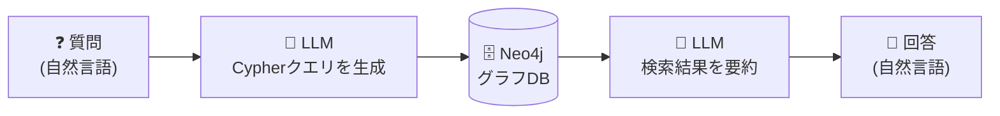
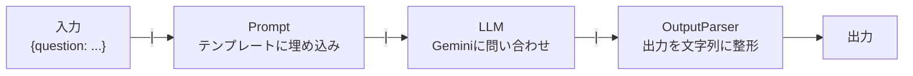
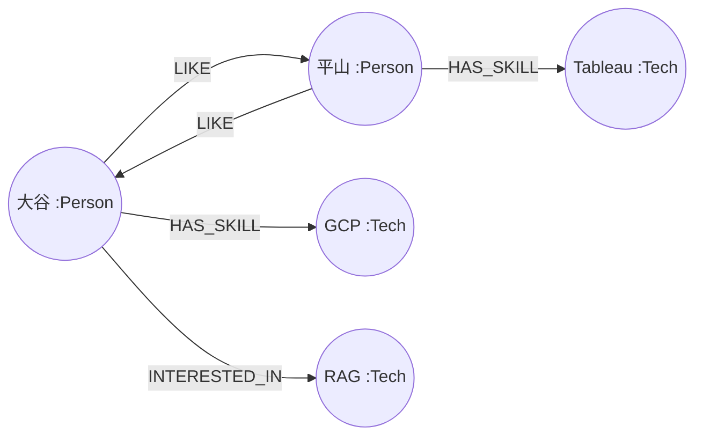
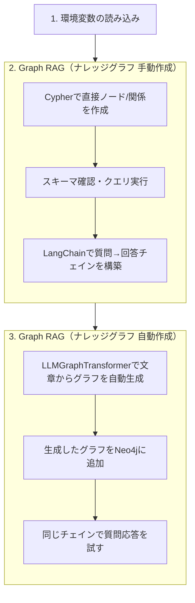
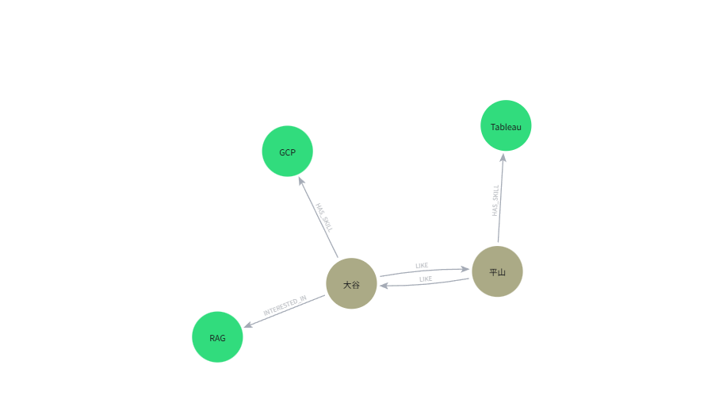
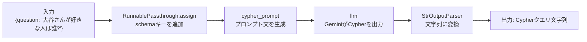
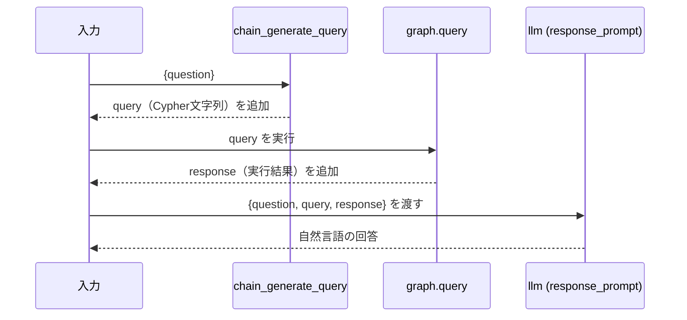
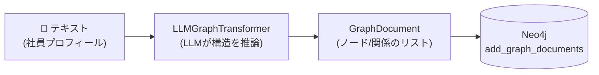
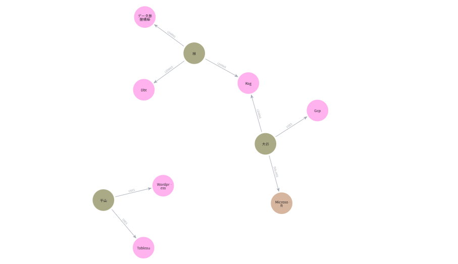

# `graph_rag.ipynb` コード解説

> 🎯 **対象読者**: Pythonの基礎（変数・関数・辞書・importなど）は理解しているが、**LangChainとNeo4jは初めて触る**という人向けの解説です。

---

## 0. まず結論：このノートブックは何をしているか

「社員のスキル」を **グラフ構造（人・技術・関係性）** としてデータベースに保存し、LLM（Gemini）に **自然言語の質問 → Cypherクエリ → 検索結果 → 自然言語の回答** という変換をさせるハンズオンです。



これを実現するために、以下の2つの技術を組み合わせます。

| 技術 | 役割 |
|---|---|
| **Neo4j** | データを「点（ノード）」と「線（リレーションシップ）」で保存するグラフデータベース |
| **LangChain** | LLM（Gemini）とNeo4jを繋ぎ、「質問→クエリ生成→実行→回答生成」という一連の処理を組み立てるフレームワーク |

---

## 1. 予備知識：LangChainとNeo4jとは

### 1-1. LangChainとは

LangChainは、LLM（ChatGPTやGeminiなどの大規模言語モデル）を使ったアプリケーションを組み立てるためのPythonフレームワークです。

素のLLM APIだけでも「質問を送って回答をもらう」ことはできますが、実際のアプリでは

- 決まった形式のプロンプト（指示文）にユーザーの入力を埋め込みたい
- LLMの出力を次の処理の入力として使いたい（＝処理を鎖のように繋ぎたい）
- 外部のデータベースやAPIとLLMを連携させたい

といったニーズが出てきます。LangChainはこれらを部品（コンポーネント）として提供し、`|`（パイプ）演算子で繋げるだけでパイプライン（**Chain**）を組めるようにしてくれます。この書き方を **LCEL（LangChain Expression Language）** と呼びます。



> 💡 このノートブックで使う主な部品
> - `ChatPromptTemplate` : プロンプトの雛形（テンプレート）
> - `ChatGoogleGenerativeAI` : Geminiモデルを呼び出す部品
> - `StrOutputParser` : LLMの出力を単純な文字列に変換する部品
> - `RunnablePassthrough` : 入力の辞書に新しいキーを追加しながら次に渡す部品

### 1-2. Neo4jとは

Neo4jは**グラフデータベース**の一種です。一般的なRDB（MySQLなど）が「表（テーブル）」でデータを表すのに対し、Neo4jは以下の2要素でデータを表します。

| 要素 | 意味 | 例 |
|---|---|---|
| **ノード (Node)** | データの実体（点） | `大谷さん`、`RAG`、`GCP` |
| **リレーションシップ (Relationship)** | ノード同士の関係（矢印） | `大谷さん -[興味がある]-> RAG` |



Neo4jに対する問い合わせには、SQLの代わりに **Cypher** という専用クエリ言語を使います。

```cypher
// 「大谷」というノードを起点に、そこから出ている関係と接続先ノードを取得
MATCH (n)-[r]->(m) RETURN n, r, m
```

「人と人・人とスキルの繋がり」のように **関係性そのものが重要な情報** を扱う場合、Neo4jのようなグラフDBは非常に強力です。

### 1-3. なぜGraph RAGなのか（VectorDBとの違い）

一般的なRAGは「文章をベクトル化して、質問文と似ている文章を検索する（VectorDB）」方式ですが、このノートブックでは代わりにグラフDBを使います。

| | VectorDB RAG | Graph RAG（本ノートブック） |
|---|---|---|
| 検索方法 | 質問文とのベクトル類似度 | LLMが生成したCypherクエリの実行結果 |
| 得意なこと | 「意味が近い文章」を探す | 「誰と誰がどう繋がっているか」を辿る／集計する |
| 苦手なこと | 関係性をたどる複雑な質問 | ベクトル的な"あいまい検索" |

（この比較は、ノートブック内 セクション3末尾のコメントにも記載されています）

---

## 2. ノートブック全体の構成



以降、この流れに沿ってセルを解説します。

---

## 3. セクション1: 環境変数の読み込み（セル2）

```python
from dotenv import load_dotenv
load_dotenv()
```

`.env` ファイルに書いた `GEMINI_API_KEY` や `NEO4J_URI` などを、環境変数としてPythonプロセスに読み込みます。これ以降に登場する `Neo4jGraph()` や `ChatGoogleGenerativeAI()` は、**引数を渡さなくても環境変数を自動的に読みに行く**ため、必ずこのセルを最初に実行する必要があります。

---

## 4. セクション2: ナレッジグラフの手動作成

### 4-1. ノードと関係の作成（セル5〜6）

```python
from langchain_neo4j import Neo4jGraph

graph = Neo4jGraph()          # ← .envの接続情報でNeo4jに接続

graph.query("""MATCH (n)
DETACH DELETE (n)""")          # ← 既存のノードを全削除（初期化）
```

- `Neo4jGraph()` : LangChainが提供する「Neo4j接続クライアント」。裏側で `NEO4J_URI` / `NEO4J_USERNAME` / `NEO4J_PASSWORD` を使って接続します。
- `graph.query(cypher文字列)` : Cypherクエリを直接実行するメソッド。
- `DETACH DELETE (n)` : ノードとそれに紐づく関係を丸ごと削除する定型句（ハンズオンを何度も実行しても差分が出ないようにするため）。

```python
sar_graph_query = """CREATE (otani:Person {name: '大谷'})
CREATE (hirayama:Person {name: '平山'})
CREATE (rag:Tech {name: 'RAG'})
CREATE (gcp:Tech {name: 'GCP'})
CREATE (tableau:Tech {name: 'Tableau'})

CREATE (otani)-[:LIKE]->(hirayama)
CREATE (otani)-[:HAS_SKILL]->(gcp)
CREATE (otani)-[:INTERESTED_IN]->(rag)
CREATE (hirayama)-[:LIKE]->(otani)
CREATE (hirayama)-[:HAS_SKILL]->(tableau)
"""
graph.query(sar_graph_query)
```

`CREATE (変数名:ラベル {プロパティ: 値})` という構文でノードを作り、`CREATE (a)-[:関係名]->(b)` で `a` から `b` への矢印（リレーションシップ）を作っています。実行結果は下図の通りです。



### 4-2. スキーマ確認とクエリ実行（セル9〜10）

```python
graph = Neo4jGraph()
print(graph.get_schema)
```

`graph.get_schema` は、現在のグラフDBに **どんなラベル（ノード種別）・関係・プロパティが存在するか** をテキストで返すプロパティです。これは後述の「LLMにCypherを生成させる」ときに、**LLMへ渡すスキーマ情報**として使われます（LLMはDBの中身を知らないので、スキーマを教えないと正しいクエリを書けません）。

```python
graph.query("""MATCH (n) -[r]-> (m)
RETURN n, r, m""")
```

すべてのノードとその関係を取得する確認用クエリです。

### 4-3. LangChain × Graph RAG（セル12〜23）

ここからが本題の「質問→Cypher→実行→回答」チェインの構築です。

#### ① 使用する部品のimport（セル12）

```python
from langchain_core.prompts import ChatPromptTemplate
from langchain_google_genai import ChatGoogleGenerativeAI
from langchain_core.output_parsers import StrOutputParser
from langchain_core.runnables import RunnablePassthrough
```

| import | 役割 |
|---|---|
| `ChatPromptTemplate` | `{変数}` を埋め込めるプロンプトの雛形 |
| `ChatGoogleGenerativeAI` | Geminiモデルの呼び出し口 |
| `StrOutputParser` | LLMの出力オブジェクトを単純な文字列に変換 |
| `RunnablePassthrough` | 辞書に新しいキーを追加しながら次の処理に渡す |

#### ② LLMの初期化（セル13）

```python
llm = ChatGoogleGenerativeAI(model="gemini-3.5-flash-lite")
```

以降、`llm` はLangChainの「Chain」の中で使い回される部品になります（`.env` の `GEMINI_API_KEY` を自動で使用）。

#### ③ 「質問→Cypher」プロンプトの作成（セル14〜17）

```python
cypher_template = """Neo4jの以下のグラフスキーマに基づいて、ユーザの質問に答えるCypherクエリを書いてください。:
{schema}
質問: {question}
Cypherクエリ:"""

cypher_prompt = ChatPromptTemplate.from_messages([
    ("system", "入力された質問をCypherクエリに変換してください。クエリ以外は生成しないでください。"),
    ("human", cypher_template),
])
```

`{schema}` と `{question}` の2箇所が後から埋め込まれる**穴あきテンプレート**です。セル16で試しに値を埋めてみて、実際にLLMへ送られる文面を確認しています。

```python
result = cypher_prompt.invoke({"schema": "test_schema_contents", "question": "test_question"})
print(result.to_string())
```

#### ④ 「質問→Cypher」チェインの組み立て（セル17〜18）

```python
chain_generate_query = (
    RunnablePassthrough.assign(schema=lambda _: graph.get_schema)
    | cypher_prompt
    | llm
    | StrOutputParser()
)
```

`|` で繋がれた順に処理が実行されます。



- `RunnablePassthrough.assign(schema=lambda _: graph.get_schema)` : 入力の `{"question": ...}` に **`schema` キーを追加**して `{"question": ..., "schema": ...}` にする、という意味です。`lambda _: ...` は「（前段の入力は使わず）常に `graph.get_schema` を計算して値にする」という関数です。
- そのままプロンプトに埋め込まれ → LLMに送られ → 出力（Cypherクエリ）が文字列として返る、という流れです。

```python
question = "大谷さんが好きな人は誰ですか？"
generated_query = chain_generate_query.invoke({"question": question})
print(generated_query)
```

`.invoke(辞書)` でチェインを実行します。これで「質問文からCypherクエリを生成する」部分ができました。

#### ⑤ 「クエリ結果→自然言語の回答」プロンプト（セル19〜20）

```python
response_template = """質問、Cypherクエリ、およびクエリ実行結果に基づいて、自然言語で回答を書いてください。:
質問: {question}
Cypherクエリ: {query}
クエリ実行結果: {response}"""
```

今度は `{question}` `{query}` `{response}` の3つを埋め込むテンプレートです。Cypherの実行結果（JSONのような構造化データ）をLLMに読ませて、人間向けの文章に言い換えさせます。

#### ⑥ 全体チェインの組み立て（セル21〜23）

セル21のメモの通り、入力の辞書が段階的に育っていくイメージです。



```python
chain = (
    RunnablePassthrough.assign(query=chain_generate_query)
    | RunnablePassthrough.assign(response=lambda x: graph.query(x["query"]))
    | response_prompt
    | llm
    | StrOutputParser()
)
```

1. `RunnablePassthrough.assign(query=chain_generate_query)` : 前段で作った「質問→Cypher」チェインをそのまま流用し、`query` キーとして追加
2. `RunnablePassthrough.assign(response=lambda x: graph.query(x["query"]))` : 生成された `query`（Cypher文字列）を実際にNeo4jへ投げて、結果を `response` キーとして追加
3. `response_prompt | llm | StrOutputParser()` : `{question, query, response}` の3つが揃ったプロンプトをLLMに渡し、自然言語の回答を生成

```python
question = "大谷さんが好きな人は誰ですか？"
result = chain.invoke({"question": question})
print(result)
```

これで「自然言語で質問 → Cypher自動生成 → DB検索 → 自然言語で回答」が1回の `.invoke()` で完結するようになりました。

---

## 5. セクション3: ナレッジグラフの自動作成（セル25〜33）

セクション2では人間がCypherで手動でグラフを作りましたが、ここではLLMに**文章からグラフ構造を自動抽出**させます。

```python
from langchain_experimental.graph_transformers import LLMGraphTransformer

llm_transformaer = LLMGraphTransformer(llm=llm)
```

`LLMGraphTransformer` は、テキストをLLMに読ませて「どんなノード・関係が存在しそうか」を推論し、グラフ構造（ノード＋リレーションシップ）に変換してくれるLangChainのツールです。

```python
from langchain_core.documents import Document

text = """社員技術プロフィール
平山さん: ・実務ではTableauを主に使用している ...
大谷さん: ・実務では主にGCPを使用している ...
林さん: ・社内の研修担当者 ...
"""

documents = [Document(page_content=text)]
graph_documents = llm_transformaer.convert_to_graph_documents(documents)
```

- `Document` : LangChainにおける「1つの文書」を表す入れ物（本文は `page_content` に入れる）。
- `convert_to_graph_documents(documents)` : LLMが文章を読み、`GraphDocument`（ノード一覧・関係一覧）のリストへ変換します。

```python
graph.add_graph_documents(graph_documents)
```

抽出されたノード・関係をNeo4jに書き込みます。これで手動作成と同様のグラフがLLMの推論だけで出来上がります。



```python
graph = Neo4jGraph()
print(graph.get_schema)
```

再度スキーマを確認し、自動生成された結果を確認します。実際に作成されたグラフは下図の通りです。



最後に、セクション2で作った `chain`（質問→Cypher→実行→回答）を、そのまま新しいグラフに対して使い回して動作確認しています。

```python
question = "大谷さんにMicrosoftの案件を任せても大丈夫か"
result = chain.invoke({"question": question})
print(result)
```

```python
question = "このデータベースには平山さんに関する情報はありますか？"
result = chain.invoke({"question": question})
print(result)
```

ここでのポイントは、**チェイン自体は一切変更していない**という点です。グラフの中身（スキーマ）が変わっても、`graph.get_schema` を都度読みに行く設計になっているため、同じコードのままグラフが更新されても動作します。

---

## 6. まとめ

- **Neo4j** はノードと関係でデータを表すグラフDB、**Cypher**が専用クエリ言語
- **LangChain** は「プロンプト → LLM → 出力整形」のような処理を `|` で繋いで **Chain** として組み立てるフレームワーク
- 本ノートブックのChainは「質問 → （LLMで）Cypher生成 → （Neo4jで）実行 → （LLMで）自然言語回答」の4段構成
- グラフは **手動（Cypherを直接書く）** でも **自動（LLMGraphTransformerで文章から抽出）** でも作成可能
- VectorDBが「意味の近さ」で検索するのに対し、Graph RAGは「関係性を辿る／集計する」質問に強い
