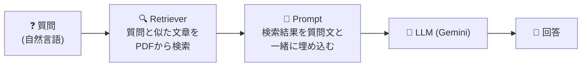
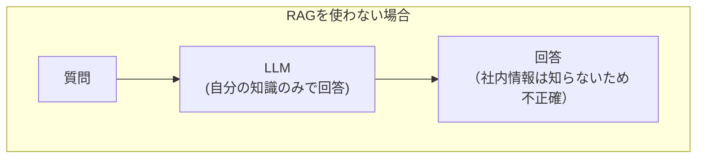
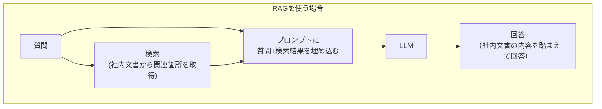
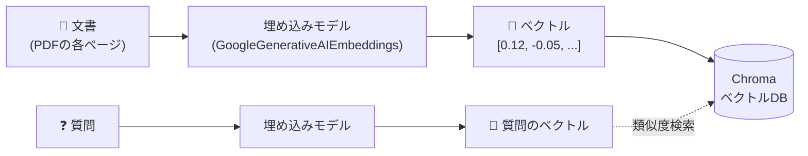
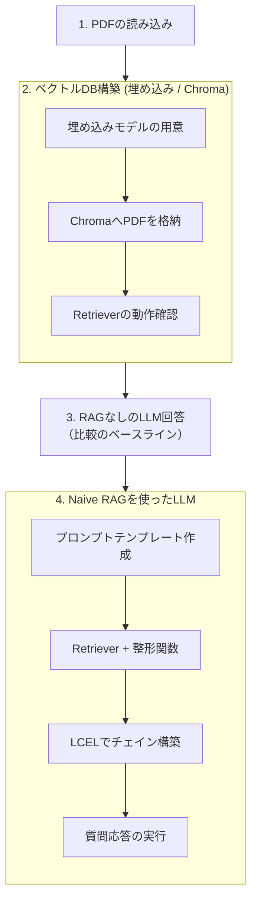
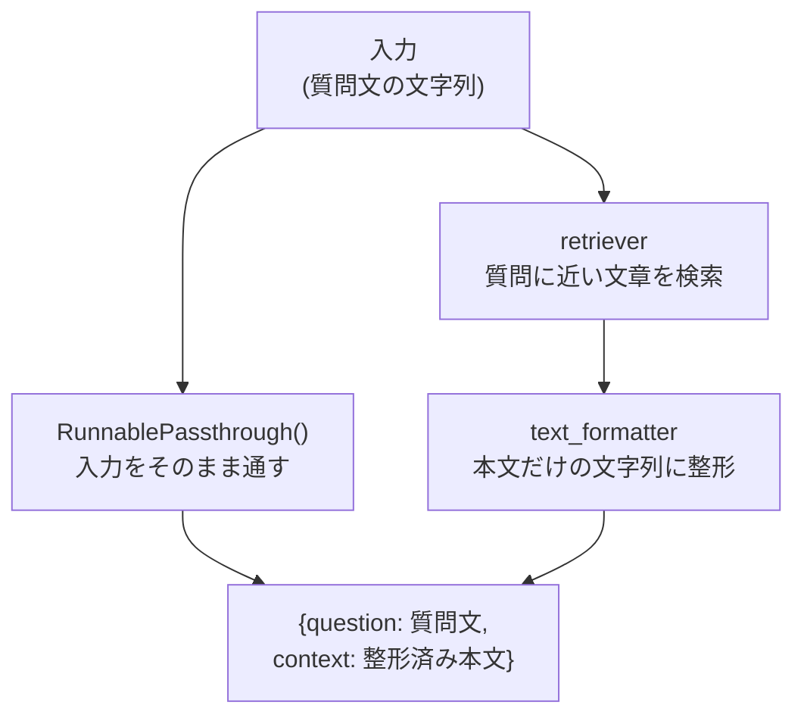
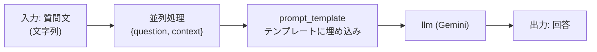

# `naive_rag.ipynb` コード解説

> 🎯 **対象読者**: Pythonの基礎（変数・関数・辞書・importなど）は理解しているが、**LangChainは初めて触る**という人向けの解説です。
> （LangChain自体の基本概念は [../graph_rag/code_overview.md](../graph_rag/code_overview.md) の「1-1. LangChainとは」でも解説しています）

---

## 0. まず結論：このノートブックは何をしているか

社内文書（PDF）を検索対象にして、**「LLMに社内文書の内容を踏まえて質問に答えてもらう」**という、最もオーソドックスな **Naive RAG（素朴なRAG）** を実装します。



「Graph RAG」がグラフDB（Neo4j）とCypherクエリを使ったのに対し、こちらは **ベクトルデータベース（Chroma）** と **埋め込みベクトルの類似度検索** を使う点が最大の違いです。

| | Naive RAG（本ノートブック） | Graph RAG |
|---|---|---|
| 保存先 | ベクトルDB（Chroma） | グラフDB（Neo4j） |
| 検索方法 | 質問文とのベクトル類似度 | LLMが生成したCypherクエリ |
| 得意なこと | 「意味が近い文章」を探す | 関係性を辿る／集計する質問 |

---

## 1. 予備知識

### 1-1. Naive RAGとは

RAG（Retrieval-Augmented Generation）は、LLMに質問する前に **関連する文書を検索（Retrieval）** し、その内容をプロンプトに含めて**生成（Generation）** させる手法です。LLMは学習データにない社内文書の内容を知らないため、検索結果を"カンニングペーパー"として渡すイメージです。




「Naive（素朴な）」と呼ばれるのは、文書を分割・検索・生成する最もシンプルな構成だからです（発展形として、検索結果を並べ替える・複数回検索するなどの手法があります）。

### 1-2. 埋め込み（Embedding）とベクトルデータベースとは

- **埋め込み（Embedding）**: 文章を「意味の近さ」を表す数値の配列（ベクトル）に変換する技術。意味が近い文章同士は、ベクトル空間上で近い位置に配置されます。
- **ベクトルデータベース（VectorDB）**: 埋め込みベクトルを保存し、「あるベクトルに近い順にデータを取り出す」ことに特化したデータベース。このノートブックでは **Chroma** というオープンソースのVectorDBを使います。



### 1-3. Retrieverとは

**Retriever（検索器）** は、「質問文を受け取り、関連度の高いドキュメントを返す」役割を持つLangChainの部品です。内部的には「質問文を埋め込みベクトルに変換 → VectorDB内で近いベクトルを検索」という処理を行います。

---

## 2. ノートブック全体の構成



---

## 3. セクション1: PDFの読み込み（セル2）

```python
from langchain_community.document_loaders import PyPDFDirectoryLoader
from pprint import pprint

pdf_dir = "../../docs"

loader = PyPDFDirectoryLoader(pdf_dir)
data = loader.load()

pprint(data)
```

- `PyPDFDirectoryLoader(pdf_dir)` : 指定したディレクトリ（`docs/`）内の **すべてのPDF** を読み込むLangChainのローダーです。対象は以下の2ファイルです。
  - `docs/employee_training_manual_faq.pdf`
  - `docs/internal_guidelines_for_it_devices_and_ai_use.pdf`
- `loader.load()` : PDFをページ単位で読み込み、`Document` オブジェクトのリストとして返します。各 `Document` は本文（`page_content`）とページ番号などのメタ情報（`metadata`）を持ちます。
- `data` にはPDFの **ページ数分** の `Document` が格納されます（後段のベクトルDBには、この1ページ＝1件として登録されます）。

> 💡 `Document` はGraph RAGのハンズオンにも登場した「1つの文書を表す入れ物」と同じ型です。

---

## 4. セクション2: ベクトルデータベースの構築（セル5〜9）

### 4-1. 埋め込みモデルの用意（セル5）

```python
from langchain_google_genai import GoogleGenerativeAIEmbeddings

embeddings_model = GoogleGenerativeAIEmbeddings(
    model="gemini-embedding-2-preview"
)
```

Geminiの埋め込みモデルを使う準備です。この `embeddings_model` を使って、文章 → ベクトルへの変換を行います（`.env` の `GEMINI_API_KEY` が必要）。

### 4-2. Chromaへの格納とRetrieverの作成（セル7〜8）

```python
from langchain_chroma import Chroma

db = Chroma.from_documents(data, embeddings_model)
```

`Chroma.from_documents(文書リスト, 埋め込みモデル)` は、内部で以下を自動的に行います。

1. `data` の各ページを `embeddings_model` でベクトル化
2. 変換したベクトルと元の文章を、Chroma（インメモリのVectorDB）に格納

```python
retriever = db.as_retriever(search_type="similarity", search_kwargs={"k": 1})
```

`db.as_retriever(...)` で、ChromaをRetriever（検索器）として扱えるようにします。

| 引数 | 意味 |
|---|---|
| `search_type="similarity"` | ベクトルの類似度で検索する方式を指定 |
| `search_kwargs={"k": 1}` | 類似度が最も高い **上位1件** だけを返す |

### 4-3. 動作確認（セル9）

```python
query = "社外に業務端末を持ち出す場合はどうすればいいですか？"
result = retriever.invoke(query)
print(result[0])
```

`retriever.invoke(質問文)` で、質問文に最も関連するPDFの1ページ（`Document`）が返ってくることを確認しています。

---

## 5. セクション3: RAGを使わない場合のLLM回答（セル11〜12）

```python
from langchain_google_genai import ChatGoogleGenerativeAI

llm = ChatGoogleGenerativeAI(model="gemini-3.5-flash-lite")

query = "社外に業務端末を持ち出す場合はどうすればいいですか？"
result = llm.invoke(query)

print(result.content[0]["text"])
```

Retrieverを一切使わず、**LLM単体に直接質問**しています。これは後段のNaive RAGの回答と見比べるための **比較用（ベースライン）** です。社内固有のルールをLLMは学習していないため、一般論での回答しか得られません。

> 💡 `result.content` はレスポンスの中身のリストで、`[0]["text"]` でテキスト部分を取り出しています。

---

## 6. セクション4: Naive RAGを使ったLLM（セル15〜24）

### 6-1. プロンプトテンプレートの作成（セル15〜16）

```python
from langchain_core.prompts.prompt import PromptTemplate

prompt_template = PromptTemplate(
    input_variables=["question", "context"],
    template="以下を参照して、質問に答えてください。\n\n{context}\n\n質問: {question}"
)
```

`{question}`（ユーザーの質問）と `{context}`（検索で見つかったPDFの本文）の2つを埋め込むテンプレートです。セル16では、実際に値を埋めた際の見た目をテスト（動作確認）しています。

```python
example = {"question": "This is question", "context": "This is context"}
result = prompt_template.invoke(example)
print(result)
```

### 6-2. Retrieverと整形関数の準備（セル17〜19）

```python
db = Chroma.from_documents(data, embeddings_model)
retriever = db.as_retriever(search_type="similarity", search_kwargs={"k": 1})
```

セクション2と同じ手順でRetrieverを再構築しています。

```python
def text_formatter(retriever_output):
    """抽出器 (Retriever) による出力を整形する"""
    raw_text = retriever_output[0].page_content
    raw_text_to_newline = raw_text.replace("\n", "")
    return raw_text_to_newline
```

`retriever.invoke(...)` の戻り値は **`Document` のリスト**（`search_kwargs={"k": 1}` なので要素数1）です。`text_formatter` は、その1件目の本文（`page_content`）を取り出し、改行を除去してプレーンな文字列に整形するヘルパー関数です。これは後でチェインの中に組み込まれます。

```python
query = "社外に業務端末を持ち出す場合はどうすればいいですか？"
retrieved = retriever.invoke(query)
print(text_formatter(retrieved))
```

### 6-3. RAGによる回答のチェイン作成（セル21〜24）

```python
from langchain_core.runnables import RunnablePassthrough

llm = ChatGoogleGenerativeAI(model="gemini-3.5-flash-lite")

chain = (
    {"question": RunnablePassthrough(), "context": retriever | text_formatter}
    | prompt_template
    | llm
)
```

ここがこのノートブックの核心部分です。1行ずつ分解します。

#### `{"question": ..., "context": ...}` という辞書の意味

LCEL（`|` で繋ぐ書き方）の中で辞書 `{key: chain, ...}` を書くと、**同じ入力を複数の処理に同時に渡し、それぞれの結果を辞書のキーにまとめる**という意味になります（内部的には `RunnableParallel` という部品として扱われます）。



- `"question": RunnablePassthrough()` : 入力（質問文の文字列）をそのまま `question` の値にする
- `"context": retriever | text_formatter` : 入力を `retriever` に渡して検索 → その結果を `text_formatter` で整形 → `context` の値にする

#### チェイン全体の流れ



1. 並列処理で `{"question": 質問文, "context": 検索結果の本文}` という辞書を作る
2. `prompt_template` にこの辞書を渡し、テンプレートへ埋め込んだプロンプトを生成
3. `llm` に渡して回答を生成

### 6-4. 実行（セル24）

```python
query = "社外に業務端末を持ち出す場合はどうすればいいですか？"
result = chain.invoke(query)
print(result.content[0]["text"])
```

`chain.invoke(質問文の文字列)` を実行すると、内部で「検索 → プロンプト生成 → LLM呼び出し」までが自動で行われ、PDFの内容を踏まえた回答が得られます。セクション3（RAGなし）の回答と比較すると、社内文書に基づいたより具体的な回答になっているはずです。

---

## 7. まとめ

- **Naive RAG** は「質問に関連する文書を検索 → プロンプトに埋め込む → LLMが回答」という最もシンプルなRAG構成
- **埋め込み（Embedding）** で文章を数値ベクトル化し、**Chroma（VectorDB）** に格納しておくことで類似度検索ができる
- **Retriever** は「質問文 → 関連文書」を返す部品で、`db.as_retriever(...)` で作成する
- LCELの `{"key": chain, ...}` という辞書表記は、**入力を複数の処理に並列で渡し、結果を1つの辞書にまとめる**（`RunnableParallel`）
- RAGあり／なしを見比べることで、「LLMが知らない社内固有の情報」を検索によって補完できていることが確認できる
